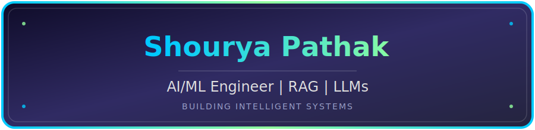

  

Building scalable AI systems powered by <b>LLMs</b>, <b>RAG</b>, <b>Computer Vision</b>, and <b>Deep Learning</b> to solve real-world challenges.

<h2>🤖 AI Dashboard</h2> 

  

<table>
<tr>
<td align="center" width="250">

### 👤 Profile

AI / ML Engineer

</td>

<td align="center" width="250">

### 🚀 Current Focus

LLMs • RAG • Computer Vision

</td>

<td align="center" width="250">

### 🛠️ Tech Stack

Python • TensorFlow • LangChain

</td>

</tr>

<tr>

<td align="center">

### ☁️ Deployment

Streamlit

</td>

<td align="center">

### 🎯 Goal

Production GenAI Applications

</td>

<td align="center">

### 📈 Status

🟢 Open to AI/ML Opportunities

</td>

</tr>

</table>

  

  

<table width="100%">
<tr>
<td valign="middle" width="60%">

- 🎓 B.Tech Computer Science student at <b>VIT Bhopal University</b> (Class of 2027) 
- 🤖 AI/ML Engineer passionate about <b>Machine Learning, Deep Learning, and Generative AI</b> 
- 🧠 Building intelligent AI systems using <b>LLMs and Retrieval-Augmented Generation (RAG)</b> 
- 🚀 Experienced in developing end-to-end AI applications with <b>Python, LangChain, Streamlit, TensorFlow and FAISS</b> 
- 🛠️ Currently exploring <b>Agentic AI, AI Agents, MLOps, and scalable AI deployment</b> 
- 💻 Solved <b>200+ DSA problems</b> across <b>LeetCode</b> 
- 🌟 Open to <b>AI/ML Engineer</b>, <b>Generative AI</b>, <b>Machine Learning</b> and internship opportunities 

</td>
<td valign="middle" width="40%" align="center">

</td>
</tr>
</table>

  

# 🚀 Tech Arsenal

  

 
<!-- ================= PROJECT 1 ================= -->

<table width="100%">
<tr>
<td align="center">

**An AI-powered resume analysis platform** evaluating resumes using a **locally hosted Llama 3.1 model** — zero API cost, fully on-device inference.

</td>
</tr>
</table>

<table width="100%">
<tr>
<td align="center" width="50%">🎯 <b>What it does</b></td>
<td align="center" width="50%">💡 <b>How it works</b></td>
</tr>
<tr>
<td align="left">Evaluates resumes with a 100-point ATS scoring engine</td>
<td align="left">Skills, projects, experience, education, grammar, and quantified achievements scored as separate modules</td>
</tr>
<tr>
<td align="left">Extracts structured data reliably</td>
<td align="left">Pydantic schemas validate and structure every parsed field</td>
</tr>
<tr>
<td align="left">Runs fully offline</td>
<td align="left">Llama 3.1 via Ollama — no external API calls</td>
</tr>
<tr>
<td align="left">Publicly accessible</td>
<td align="left">Deployed live on Streamlit Cloud</td>
</tr>
</table>

 

<!-- ================= PROJECT 2 ================= -->

<table width="100%">
<tr>
<td align="center">

A **Retrieval-Augmented Generation** system pairing semantic search with a fine-tuned language model to answer healthcare questions with **grounded, hallucination-resistant responses**.

</td>
</tr>
</table>

<table width="100%">
<tr>
<td align="center" width="50%">🎯 <b>What it does</b></td>
<td align="center" width="50%">💡 <b>How it works</b></td>
</tr>
<tr>
<td align="left">Answers healthcare questions accurately</td>
<td align="left">Hybrid pipeline: FAISS vector search + fine-tuned DialoGPT</td>
</tr>
<tr>
<td align="left">Understands context, not just keywords</td>
<td align="left">Sentence Transformers power semantic retrieval</td>
</tr>
<tr>
<td align="left">Minimizes hallucinated answers</td>
<td align="left">Dynamic retrieval-generation switching decides when to fetch vs. generate</td>
</tr>
<tr>
<td align="left">Adds real-world value</td>
<td align="left">Recommends nearby hospitals via Google Maps API integration</td>
</tr>
</table>

 

<!-- ================= PROJECT 3 ================= -->

<table width="100%">
<tr>
<td align="center">

A **multiclass MRI classification system** for automated brain tumor detection using transfer learning — built for clinical-grade accuracy.

</td>
</tr>
</table>

<table width="100%">
<tr>
<td align="center" width="50%">🎯 <b>What it does</b></td>
<td align="center" width="50%">💡 <b>How it works</b></td>
</tr>
<tr>
<td align="left">Classifies MRI scans into 4 categories</td>
<td align="left">Glioma · Meningioma · Pituitary · No Tumor</td>
</tr>
<tr>
<td align="left">Sees cleaner scans</td>
<td align="left">OpenCV preprocessing enhances raw MRI images</td>
</tr>
<tr>
<td align="left">Learns from limited medical data</td>
<td align="left">VGG16 transfer learning instead of training from scratch</td>
</tr>
<tr>
<td align="left">Delivers strong, validated results</td>
<td align="left">97% accuracy · 0.95 weighted F1-score</td>
</tr>
</table>

<b>Accuracy</b>&nbsp;&nbsp;
 
<b>F1-Score</b>&nbsp;&nbsp;

 

  

## 📈 Behind The Commits

  

  

  

# 🏆 Competitive Programming

### 🧩 LeetCode Grind

  

  

